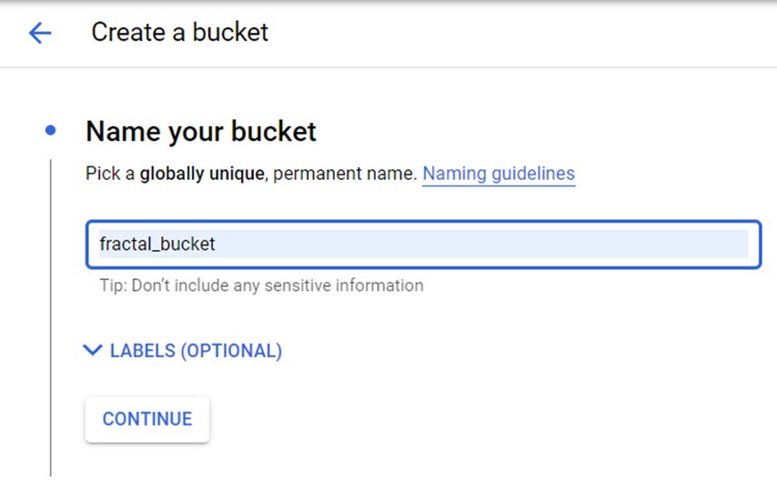
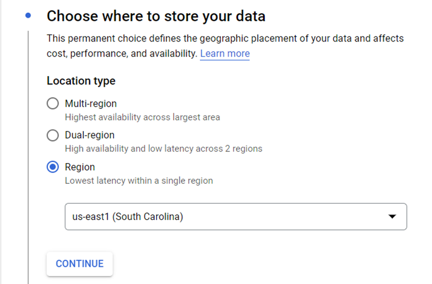
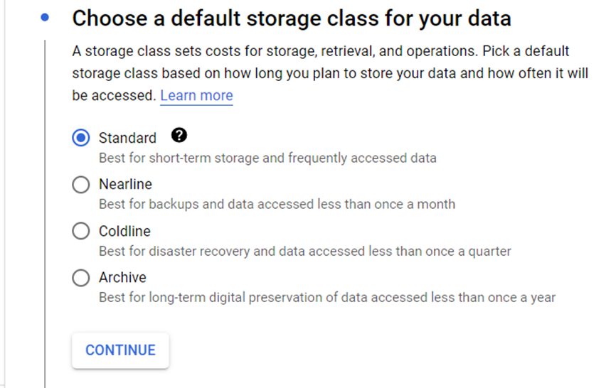
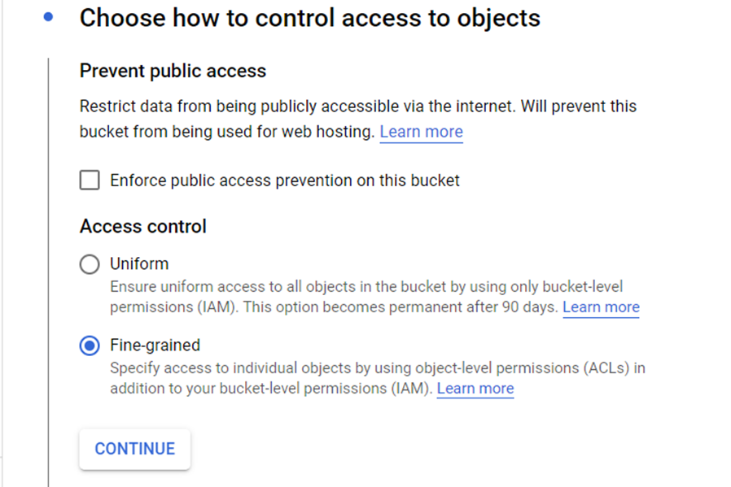
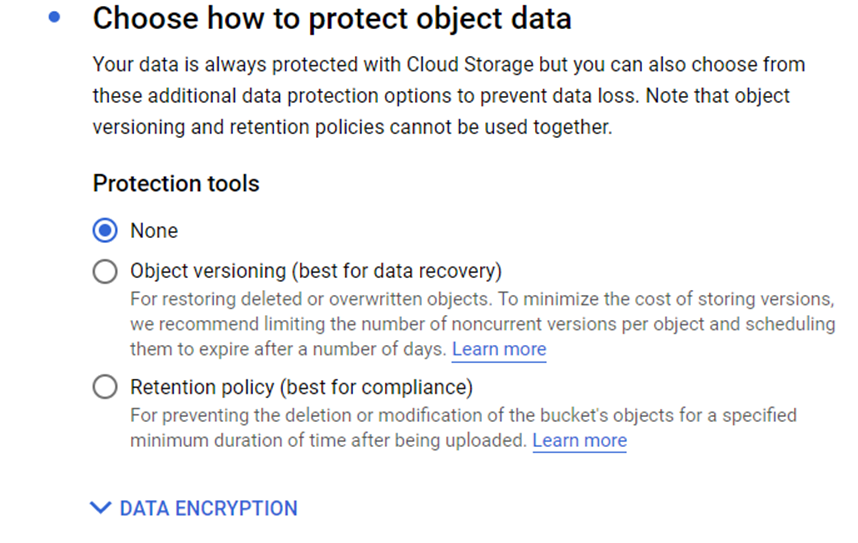
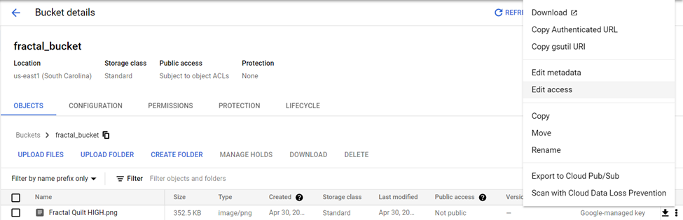
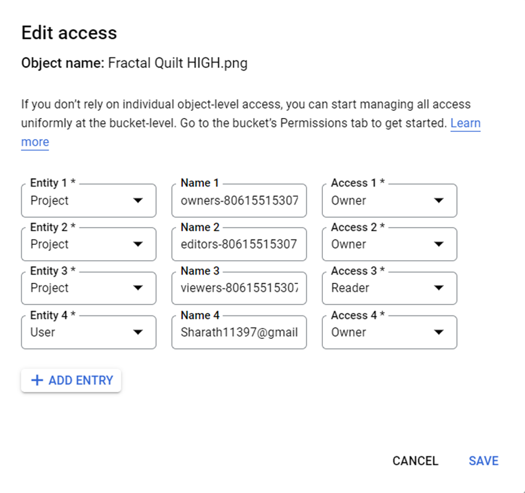
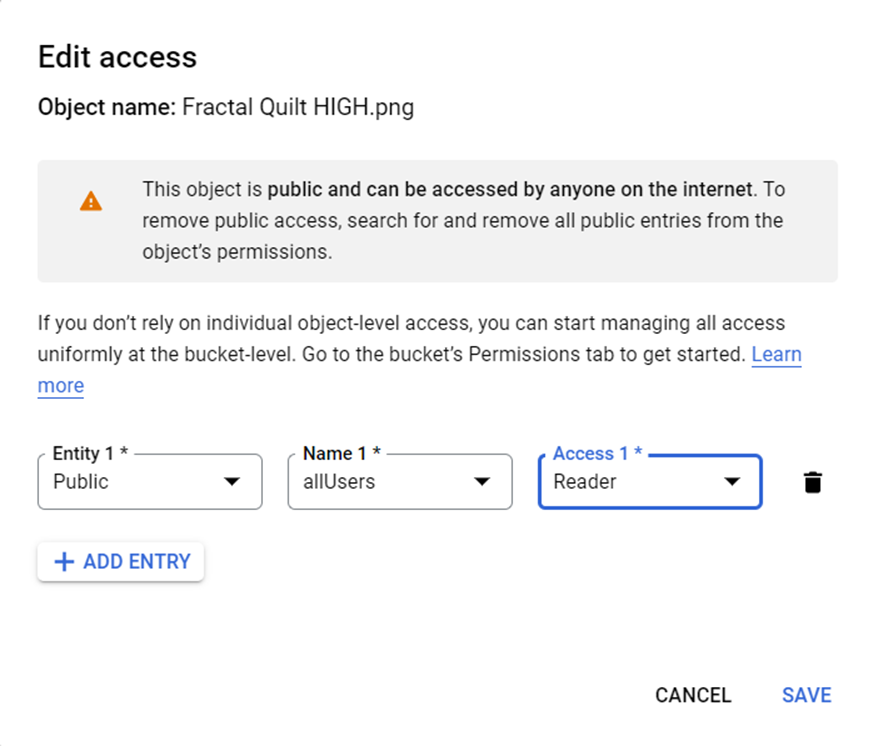
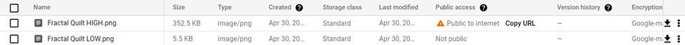
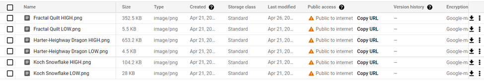

## Steps to Deploy

- Create a project on Google Cloud Platform Console associated with the correct billing account.
- Search and enable the following APIs:
    - Cloud Build
    - Cloud Shell
    - Cloud Functions
- Create a Cloud Storage Bucket to upload the screenshots of the fractals <!-- Add screenshots and highlight access selection-->

- Enter the name of your bucket:

- Choose the region where you would like to store your data:

- Choose default storage class for your data:

- Choose how to control access to objects:

- Type of data protection within secured Google Cloud Platform:

- Sample fractal images added to the cloud bucket

- Type of access initial given to image object:

- Later, it can be changed to project requirements:

- Once the access is changed according to requirements, you can view the public URL to access the image:

- Enabled public access to remaining images:

- Clone the forked git repo (git link)

- Install Google Cloud SDK Shell on local machine

- Login to your account and select the newly created project

- Change the current working directory to cloud/python

- Make the required changes on main.py and index.html

- Create the Cloud Function using the below command:

`Command: gcloud functions deploy fractals --runtime python39 --trigger-http --allow-unauthenticated`

## Code Changes 

- Modify the function name translate to fractals in main.py

- Clear the body of the html page

- Create labels for fractals with corresponding public URLs in index.html
